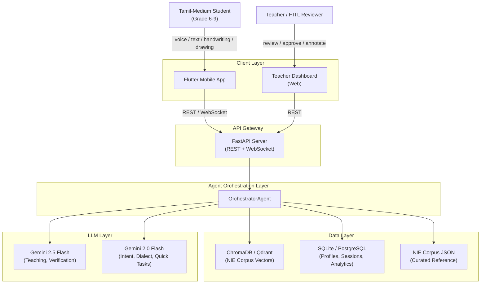
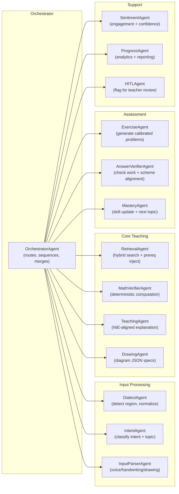
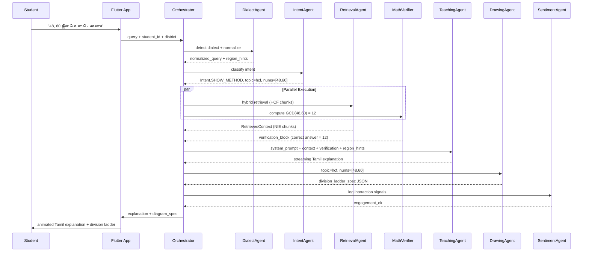

# Enterprise Architecture: NIE Tamil AI Tutor Platform

## 1. Side-by-Side Codebase Comparison

### 1.1 Architecture Patterns

- **Existing PoC** ([adaptive_rag_chapter4.py](adaptive_rag_chapter4.py) + [tutor_llm.py](tutor_llm.py)): Monolithic engine (1891 lines). All logic in one file: corpus, retrieval, intent classification, student profiles, diagram generation, exercise generation, prompt building. `tutor_llm.py` (540 lines) is a thin CLI bridge to Gemini/Ollama. Works end-to-end.
- **Claude Code** ([src/agent_orchestrator.py](src/agent_orchestrator.py) + [src/pipeline_ingestion.py](src/pipeline_ingestion.py)): Multi-agent with 8 specialist agents (`DialectAgent`, `QueryAgent`, `RetrievalAgent`, `TeachingAgent`, `DrawingAgent`, `ExerciseAgent`, `VerificationAgent`, `StudentProfileAgent`) coordinated by `OrchestratorAgent`. Separate ingestion pipeline. Not yet tested.

### 1.2 What to Keep from Each

**From the existing PoC (proven, keep):**

- Deterministic math verification (`_positive_divisors`, `_factor_verification_block_tamil`, `_hcf_verification_block_tamil`) -- critical for 100% accuracy on numeric answers
- NIE register enforcement and regional dialect bridging (`_nie_register_and_ladder_guidance`)
- Socratic rule with explicit exceptions for direct computational queries
- The refined Gemini streaming integration with thinking-budget control
- `PREREQUISITE_GRAPH` and `TOPIC_TO_SKILL` mappings (pedagogically validated)
- NIE-method-specific prompt sections (Section 4.1 pair method, Section 4.4 prime factorization guidance)

**From the Claude code (adopt the patterns):**

- Multi-agent separation of concerns (but fix the issues: implement real message passing, add parallelism where claimed)
- PDF ingestion pipeline with TSCII handling, semantic chunking, ChromaDB storage
- BGE-M3 embeddings for multilingual Tamil vector search
- Answer scheme ingestion as a separate collection
- `VerificationAgent` concept (compare student answers against answer schemes)
- Async-ready architecture

**From neither (build new):**

- True hybrid search (vector + BM25/keyword, not just filtered vector)
- LLM-based intent classification with rule-based fallback (not one or the other)
- Structured agent communication via typed message protocol
- Event-driven student analytics pipeline
- HITL review queue

### 1.3 Critical Gaps in Both Codebases

- **No answer-scheme alignment**: Neither codebase maps exercises to NIE marking schemes to enforce the "exam-recommended method"
- **No session conversation memory**: Each query is stateless; no multi-turn context window
- **No sentiment/engagement detection**: No signal capture from student behavior
- **No teacher dashboard or HITL**: No human review path
- **No multimodal input pipeline**: Voice, handwriting, drawing recognition are not connected

---

## 2. Target Enterprise Architecture

### 2.1 System Context




### 2.2 Agent Architecture




### 2.3 Agent Responsibilities (Detailed)

**Input Processing Agents:**

- **DialectAgent**: Rule-based region detection from district + keyword signatures. Outputs NIE-normalized query + regional synonym bridge hints. LLM fallback for ambiguous cases. (Adopt Claude's `DialectAgent` structure, inject existing `_nie_register_and_ladder_guidance` logic.)
- **IntentAgent**: Two-tier: rule-based keyword scoring (existing `IntentClassifier` logic) first; if confidence < threshold, escalate to Gemini 2.0 Flash for LLM classification. Returns `Intent` enum + `topic` + extracted numbers.
- **InputParserAgent**: Receives raw multimodal input from Flutter. Routes voice to Google Cloud Speech-to-Text (Tamil ASR). Routes handwriting images to Google ML Kit. Routes drawing canvas to shape recognition. Outputs normalized text query.

**Core Teaching Agents:**

- **RetrievalAgent**: True hybrid search -- vector similarity (BGE-M3 via ChromaDB) combined with BM25 keyword scoring. Metadata pre-filter by difficulty ceiling and unlocked topics (from existing `_pre_filter` logic). Prerequisite injection when mapped skill < 0.4. Returns ranked `RetrievedContext` with chunk metadata.
- **MathVerifierAgent**: The existing deterministic math functions extracted into a standalone agent. Given a query with numbers + intent (factors, HCF, LCM, prime factorization), computes the mathematically correct answer using Python `math.gcd`, `math.lcm`, custom `_positive_divisors`. Injects verification blocks into the teaching prompt. This agent guarantees 100% numeric accuracy -- no LLM hallucination risk for computations.
- **TeachingAgent**: Builds the system prompt with NIE pedagogy rules, Tamil-only constraints, method guidance, and verification anchors. Calls Gemini 2.5 Flash with streaming. Manages the response quality contract (no English, correct terminology, textbook methods).
- **DrawingAgent**: Deterministic diagram generation (no LLM needed). Given topic + numbers, produces structured JSON spec for Flutter `CustomPainter` rendering. Supports: factor trees, division ladders, factor pair tables, number lines, multiples grids. All labels in Tamil.

**Assessment Agents:**

- **ExerciseAgent**: Generates calibrated exercises based on student's current skill level and topic. Difficulty scales with mastery. Returns structured `ExerciseBundle` with question, expected answer, method, and hints.
- **AnswerVerifierAgent**: Two-path verification:
  - **Deterministic path**: For numeric answers (factors, HCF, LCM), compute correct answer and compare directly.
  - **LLM path**: For method/working verification, send student's work + answer scheme + correct answer to Gemini 2.5 Flash with strict Socratic correction rules.
  - **Scheme alignment**: Cross-reference with ingested NIE answer schemes to verify the student used the exam-recommended method.
- **MasteryAgent**: Updates `StudentProfile.skills` based on exercise outcomes. Determines next topic using `PREREQUISITE_GRAPH`. Decides whether to advance, review, or loop back. Adjusts difficulty ceiling.

**Support Agents:**

- **SentimentAgent**: Analyzes student interaction patterns (response time, retry count, help requests, emoji usage, session duration trends) to estimate engagement and confidence. Lightweight -- rule-based signals first, periodic LLM analysis for nuanced assessment. Outputs `engagement_score`, `confidence_level`, `frustration_detected` flags.
- **ProgressAgent**: Aggregates skill data across sessions. Generates progress reports for students and teachers. Tracks: topics mastered, time-per-topic, accuracy trends, common error patterns, session frequency.
- **HITLAgent**: Flags interactions for teacher review when: (a) student reports confusion 3+ times on same topic, (b) LLM response fails quality checks, (c) student answers consistently wrong on a skill, (d) new content outside corpus is requested. Teacher can annotate, approve, or override via dashboard.

### 2.4 Data Flow: Complete Query Lifecycle




### 2.5 Data Architecture

**Vector Store (ChromaDB, migrating to Qdrant for production):**

- Collection per chapter: `nie_curriculum_g7_ch4_math`, `nie_answers_g7_ch4_math`
- Embedding: BGE-M3 (multilingual, strong Tamil support, 1024-dim)
- Metadata: `topic`, `section`, `difficulty`, `type`, `page`, `prerequisites`, `method_number`, `diagram_trigger`
- Hybrid query: dense vector similarity + metadata filter + keyword boost

**Relational Store (SQLite for PoC, PostgreSQL for production):**

- `students`: profile, district, grade, created_at
- `skills`: student_id, skill_name, score (0.0-1.0), updated_at
- `sessions`: session_id, student_id, started_at, ended_at, query_count
- `interactions`: session_id, query, intent, response_summary, response_time_ms, diagram_shown, exercise_given
- `exercise_outcomes`: interaction_id, question, student_answer, correct_answer, is_correct, method_used, method_expected, feedback
- `sentiment_signals`: interaction_id, engagement_score, confidence_level, frustration_flag
- `hitl_queue`: interaction_id, flag_reason, teacher_id, status, annotation

**Curated Reference (JSON, version-controlled):**

- `NIE_CORPUS` chunks: hand-reviewed, authoritative, used as ground truth when vector retrieval is uncertain
- `PREREQUISITE_GRAPH`: topic dependency DAG
- `TOPIC_TO_SKILL`: mapping for skill tracking
- `GLOSSARY`: NIE Tamil mathematical terminology with regional variants
- `ANSWER_SCHEMES`: method-tagged solutions keyed by section + exercise number

---

## 3. Addressing the 7 Enterprise Concerns

### Concern 1: Intelligent Dynamic Context Engineering

**Current state**: Hardcoded 25-chunk `NIE_CORPUS` with keyword-based retrieval.

**Target state**: Hybrid retrieval pipeline:

1. **Offline ingestion** ([pipeline_ingestion.py](src/pipeline_ingestion.py) pattern): Extract full textbook PDFs via PyMuPDF + TSCII decoder + OCR fallback. Semantic chunking by NIE section patterns. Embed with BGE-M3. Store in ChromaDB with rich metadata.
2. **Online retrieval** (merge existing `AdaptiveRetriever` logic with vector search):
  - Step 1: IntentAgent classifies query -> determines allowed chunk types + topic
  - Step 2: RetrievalAgent runs vector query with metadata pre-filter (difficulty <= ceiling, topic in unlocked_topics)
  - Step 3: BM25 keyword re-ranking to boost exact Tamil term matches
  - Step 4: Prerequisite injection if student skill < 0.4 on required prereqs
  - Step 5: Curated `NIE_CORPUS` fallback if vector results score below confidence threshold
3. **Dynamic prompt assembly**: Context is assembled from retrieval results, not hardcoded. MathVerifierAgent adds deterministic verification blocks. DialectAgent adds regional terminology hints.

**Key decision**: Keep the curated `NIE_CORPUS` as a "gold standard" fallback. Vector retrieval extends coverage; curated corpus ensures quality for critical topics.

### Concern 2: Multimodal Input

**Architecture**: `InputParserAgent` handles all modalities, normalizing to text before downstream agents process.

- **Voice (Tamil ASR)**: Google Cloud Speech-to-Text v2 with Tamil (`ta-IN`) model. Flutter plugin `speech_to_text`. Offline: Whisper (small model, on-device via `whisper.cpp`). ASR output -> text query.
- **Writing pad (handwriting)**: Google ML Kit Digital Ink Recognition (supports Tamil script + math symbols). Flutter `google_ml_kit` plugin. On-device, works offline. Output: recognized text.
- **Drawing pad (student diagrams)**: HTML5 Canvas in Flutter WebView or Flutter `CustomPaint` with touch capture. Shape recognition via geometric heuristics (line detection, circle detection). AI evaluation: send canvas image to Gemini 2.5 Flash with vision for diagram assessment.
- **AI diagram drawing**: DrawingAgent outputs structured JSON. Flutter `CustomPainter` renders animated SVGs/Canvas with Tamil labels. No LLM needed for rendering -- deterministic pipeline.

### Concern 3: Correct Answer Methods and Terminology

**Method alignment with NIE textbook:**

- Each corpus chunk is tagged with `method_number` (Method I, II, III for HCF; Section 4.1, 4.4 for factors)
- Answer schemes are ingested with method tags: "this exercise expects Method II (prime factorization)"
- TeachingAgent's system prompt includes explicit NIE method hierarchy (already implemented in existing code's "NIE காரணிகள் காணும் முறை" section)
- AnswerVerifierAgent checks not just correctness but method: "Student got correct answer but used trial division instead of NIE Method II -- guide them"

**Terminology enforcement:**

- Existing `_nie_register_and_ladder_guidance` logic is preserved and enhanced
- `GLOSSARY` reference data maps: NIE formal term -> regional variants -> English equivalent
- TeachingAgent system prompt mandates NIE terms (`வகுத்தல்` not `பிரித்தல்`) with regional bridging when `student.district` indicates estate/Batticaloa

### Concern 4: Student Engagement and Sentiment

**SentimentAgent signals (rule-based first, LLM-enhanced later):**

- **Engagement**: session duration, queries per session, voluntary exercise attempts, time between queries
- **Confidence**: first-attempt accuracy, hint usage frequency, self-correction rate
- **Frustration**: repeated same question, rapid session exits, long pauses after wrong answers, explicit frustration keywords in Tamil ("புரியவில்லை" = "I don't understand")
- **Encouragement injection**: When confidence drops, TeachingAgent receives a flag to include encouraging Tamil phrases ("நன்றாக முயற்சிக்கிறீர்கள்!" = "You're trying well!") and to simplify explanations

**Gamification hooks (Flutter client):**

- Streak tracking (consecutive correct answers)
- Topic badges when mastery > 0.8
- Progress visualization (skill radar chart in Tamil)

### Concern 5: Student Progress Measurement

**ProgressAgent tracks:**

- Per-skill mastery scores (0.0 - 1.0) over time
- Topic completion percentage per chapter
- Error pattern analysis: which types of mistakes recur (e.g., always forgets to check divisibility by 3)
- Time-to-mastery per topic
- Comparison with anonymized cohort averages (when deployed at scale)

**Reports generated:**

- Student self-view: "You've mastered 4/7 skills in Chapter 4. Next: HCF"
- Teacher view: per-student and class-level dashboards
- All in Tamil (student view) and bilingual Tamil/English (teacher view)

### Concern 6: Human-in-the-Loop (HITL)

**HITLAgent triggers:**

- Student stuck on same topic for 3+ sessions
- LLM response flagged by quality heuristics (too short, contains English, math mismatch with MathVerifier)
- Student explicitly requests human help ("ஆசிரியரிடம் கேளுங்கள்")
- New content requested outside corpus coverage

**Teacher dashboard features:**

- Review queue with flagged interactions (query, AI response, student context)
- Annotate: approve, edit response, add notes
- Override: correct AI's answer, update corpus with teacher-validated content
- Analytics: which topics generate most HITL flags, response quality trends

**Implementation**: FastAPI endpoint for dashboard. SQLite `hitl_queue` table. WebSocket for real-time notifications.

### Concern 7: Complete Multi-Adaptive Agentic Architecture

**Additional concerns not yet covered:**

- **Conversation memory**: Maintain a sliding window of last N interactions within a session. TeachingAgent receives session context to avoid repeating explanations and to build on prior dialogue.
- **Curriculum graph**: Beyond `PREREQUISITE_GRAPH`, encode the full NIE curriculum as a DAG with weighted edges (difficulty, estimated time). MasteryAgent uses this for adaptive pathfinding.
- **Content versioning**: When NIE updates textbooks, the corpus must be re-ingested. Version the vector store collections. Track which students learned from which corpus version.
- **Offline-first**: Flutter app caches last N sessions + current chapter corpus via IndexedDB/Hive. Queue queries when offline, sync when connected.
- **Security and privacy**: Student data is PII. Encrypt at rest, minimal data transmission, comply with Sri Lanka's data protection regulations.
- **Observability**: Log all agent decisions, LLM calls, retrieval results, and response times. Structured logging for debugging and quality monitoring.
- **Cost management**: Gemini API calls are metered. Cache common query-response pairs. Use Gemini 2.0 Flash (cheaper) for classification/parsing, reserve 2.5 Flash for teaching/verification.

---

## 4. Phased Evolution Roadmap

### Phase 1: Foundation Merge (Weeks 1-3)

- Refactor `adaptive_rag_chapter4.py` into modular agents (separate files, one class per file)
- Integrate `pipeline_ingestion.py` for PDF-to-vector ingestion (replace hardcoded corpus as primary, keep curated corpus as fallback)
- Implement true hybrid retrieval (vector + keyword + metadata filter)
- Add FastAPI wrapper around orchestrator for API access
- Preserve all existing deterministic math verification and prompt engineering
- **Deliverable**: Working multi-agent backend with vector DB, runnable from CLI and API

### Phase 2: Assessment and Methods (Weeks 4-5)

- Implement AnswerVerifierAgent with method-checking against answer schemes
- Ingest answer schemes with method tags
- Add conversation memory (session-scoped context window)
- Implement MasteryAgent with adaptive topic progression
- **Deliverable**: Student can do exercises, get method-aware feedback, and progress through topics

### Phase 3: Engagement and Analytics (Weeks 6-7)

- Implement SentimentAgent (rule-based signals)
- Build ProgressAgent with skill tracking and reporting
- Add encouragement injection to TeachingAgent
- Schema for analytics tables (sessions, interactions, outcomes, sentiment)
- **Deliverable**: Student progress is tracked and engagement signals are captured

### Phase 4: HITL and Dashboard (Weeks 8-9)

- Implement HITLAgent with flagging rules
- Build teacher dashboard (web, basic CRUD + review queue)
- Teacher annotation workflow
- **Deliverable**: Teachers can review and improve AI responses

### Phase 5: Multimodal Input (Weeks 10-12)

- Integrate Google Cloud Speech-to-Text for Tamil voice input
- Integrate Google ML Kit for handwriting recognition
- Connect drawing pad to DrawingAgent for interactive diagrams
- **Deliverable**: Students can speak, write, and draw -- not just type

---

## 5. File Structure (Target)

```
ai-mathematics/
  src/
    agents/
      __init__.py
      orchestrator.py          # OrchestratorAgent
      dialect_agent.py         # DialectAgent  
      intent_agent.py          # IntentAgent (merged classifier)
      retrieval_agent.py       # RetrievalAgent (hybrid search)
      math_verifier.py         # MathVerifierAgent (deterministic)
      teaching_agent.py        # TeachingAgent (prompt + LLM)
      drawing_agent.py         # DrawingAgent (diagram JSON)
      exercise_agent.py        # ExerciseAgent
      answer_verifier.py       # AnswerVerifierAgent
      mastery_agent.py         # MasteryAgent
      sentiment_agent.py       # SentimentAgent
      progress_agent.py        # ProgressAgent
      hitl_agent.py            # HITLAgent
      input_parser.py          # InputParserAgent (multimodal)
    data/
      nie_corpus.py            # Curated gold-standard corpus
      prerequisite_graph.py    # PREREQUISITE_GRAPH + TOPIC_TO_SKILL
      glossary.py              # NIE terminology + regional variants
    ingestion/
      pipeline.py              # PDF extraction + chunking + embedding
      vector_store.py          # ChromaDB/Qdrant wrapper
      answer_schemes.py        # Answer scheme ingestion
    models/
      student.py               # StudentProfile dataclass
      messages.py              # Agent message types (typed dataclasses)
      intents.py               # Intent enum + topic definitions
    storage/
      db.py                    # SQLite/PostgreSQL operations
    api/
      server.py                # FastAPI endpoints
      websocket.py             # WebSocket for streaming
    config.py                  # All configuration, env vars
    llm_client.py              # Gemini/Ollama client abstraction
  data/
    vectordb/                  # ChromaDB persistent storage
    nie_corpus_ch4.json        # Ingested corpus (generated)
  tests/
    test_math_verifier.py
    test_intent_agent.py
    test_retrieval_agent.py
  requirements.txt
  .env.example
  ARCHITECTURE.md
```

