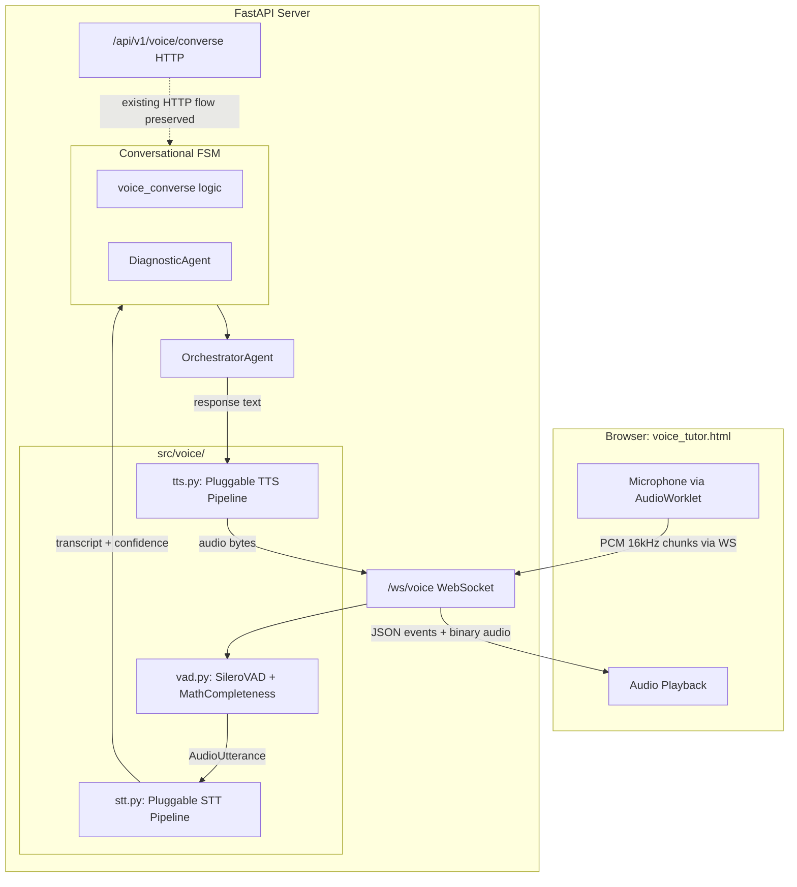

# Phase 4: Real-Time Voice Integration + Agent Cleanup

## Architecture Overview




## Step 2: Refactor Orchestrator — Remove Inline Agent Duplication

`[src/agents/orchestrator.py](src/agents/orchestrator.py)` defines 6 agent classes inline (lines 61-407) that duplicate standalone files:


| Inline class          | Standalone file      | API differences                                                                  |
| --------------------- | -------------------- | -------------------------------------------------------------------------------- |
| `ExerciseAgent`       | `exercise_agent.py`  | Same `generate(ctx, student)` signature; standalone is more complete (365 lines) |
| `AnswerVerifierAgent` | `answer_verifier.py` | Inline takes `llm` in `verify()`; standalone takes `gemini_client` in `__init__` |
| `MasteryAgent`        | `mastery_agent.py`   | Standalone has richer skill progression logic                                    |
| `SentimentAgent`      | `sentiment_agent.py` | Standalone is more comprehensive                                                 |
| `ProgressAgent`       | `progress_agent.py`  | Standalone has Tamil progress summaries                                          |
| `HITLAgent`           | `hitl_agent.py`      | Standalone has English filtering                                                 |


**Actions:**

- Delete the 6 inline classes from `orchestrator.py` (lines 61-407)
- Add imports for the standalone versions: `from src.agents.exercise_agent import ExerciseAgent`, etc.
- Adjust `OrchestratorAgent.__init__` to pass correct constructor args to standalone agents (e.g., `AnswerVerifierAgent(model=config.llm_fast_model())`)
- Fix `AnswerVerifierAgent.verify()` call sites — standalone doesn't take `llm` as first arg, it uses its own Gemini client
- Move `SOCRATIC_HINTS` dict to `answer_verifier.py` (standalone already has it)

## Step 3: Create `src/voice/` Package from Prototype

New package structure:

```
src/voice/
  __init__.py     — exports: VoiceActivityDetector, TamilSTTPipeline, TamilTTSPipeline, AudioUtterance
  vad.py          — from _obsolete/claude/voice-agent/voice_vad.py
  stt.py          — STT classes from voice_stt_tts.py + existing Gemini STT
  tts.py          — TTS classes from voice_stt_tts.py + new Gemini TTS backend
```

### `src/voice/vad.py`

Adapted from `[_obsolete/claude/voice-agent/voice_vad.py](_obsolete/claude/voice-agent/voice_vad.py)`:

- `VADConfig` — config dataclass with district-aware pause tuning
- `SileroVAD` — ONNX wrapper (auto-downloads 92kB model to `models/`)
- `MathCompletenessChecker` — detects if Tamil math question is complete
- `TamilNumberNormalizer` — spoken Tamil number words to digits
- `VoiceActivityDetector` — main class: async generator yielding `AudioUtterance`
- `AudioUtterance` — dataclass for captured speech segments
- Fix imports: change `from voice_vad import ...` to relative `from .vad import ...`

### `src/voice/stt.py`

Pluggable STT pipeline with three backends:

- `**GeminiSTT**` (default) — wraps the existing `_gemini_transcribe` logic from `server.py`; uses `GEMINI_API_KEY`, no extra credentials
- `**GoogleCloudSTT**` — from prototype; uses `chirp_2` model + speech adaptation; requires `google-cloud-speech` + `GOOGLE_APPLICATION_CREDENTIALS`
- `**WhisperOfflineSTT**` — from prototype; offline fallback using Whisper `small` model
- `**TamilSTTPipeline**` — orchestrates: pick backend, run STT, dialect detection, math normalization, completeness check
- `**DialectDetector**` — district-based + lexical marker dialect detection
- `**MathTextNormalizer**` — ASR error correction for math terms
- `**STTResult**` — output dataclass
- Config via env: `STT_BACKEND=gemini|google_cloud|whisper` (default: `gemini`)

### `src/voice/tts.py`

Pluggable TTS pipeline:

- `**GeminiTTS**` (default) — uses Gemini API for TTS synthesis; leverages existing `GEMINI_API_KEY`
- `**GoogleCloudTTS**` — from prototype; uses `ta-IN-Neural2-A` voice; requires `google-cloud-texttospeech`
- `**TamilTTSPipeline**` — orchestrates: SSML building, caching (disk + memory), streaming chunked synthesis
- `**MathSSMLBuilder**` — converts math text to SSML for correct Tamil pronunciation
- Config via env: `TTS_BACKEND=gemini|google_cloud` (default: `gemini`)

## Step 4: WebSocket Endpoint in FastAPI

Add to `[src/api/server.py](src/api/server.py)`:

```python
@app.websocket("/ws/voice")
async def ws_voice(ws: WebSocket):
```

**Protocol (browser -> server):**

- Binary frames: raw PCM 16kHz mono 16-bit audio chunks (30ms = 960 bytes)
- JSON frames: `{"type": "start", "student_id": "...", "district": "...", "session_key": "..."}`, `{"type": "stop"}`, `{"type": "text_input", "text": "..."}` (fallback for typed input)

**Protocol (server -> browser):**

- JSON frames: `{"type": "listening_start"}`, `{"type": "stt_result", "text": "...", "confidence": 0.9}`, `{"type": "response", ...}` (same shape as `/api/v1/voice/converse` response), `{"type": "tts_start"}`, `{"type": "tts_end"}`
- Binary frames: TTS audio chunks (MP3/OGG)

**Session lifecycle:**

1. Browser connects with query params or sends `start` JSON
2. Server creates `VoiceActivityDetector` for the session
3. Browser streams PCM audio -> server feeds into VAD
4. VAD yields utterances -> STT -> existing `voice_converse` logic -> response
5. Response text -> TTS -> audio chunks sent back to browser
6. Loop until disconnect

Existing HTTP endpoints remain unchanged for backward compatibility.

## Step 5: Integrate VAD + STT into Conversational FSM

Wire the voice pipeline into the existing FSM states (`ConversationState` enum in `server.py`):

- The WebSocket handler creates a per-connection `VoiceActivityDetector` + `TamilSTTPipeline`
- When VAD yields an utterance, it flows through STT, then calls the same `voice_converse` logic
- Low-confidence STT results trigger `CLARIFYING` state (existing behavior)
- `DIAGNOSING` state flows work unchanged — the WebSocket just sends/receives differently
- Add a new `VAD_LISTENING` visual state so the UI can show VAD status (speech detected, pause, etc.)

## Step 6: Server-Side TTS

Replace browser `speechSynthesis` with server-side TTS:

- **WebSocket mode:** Server synthesizes response text via `TamilTTSPipeline`, streams MP3/OGG audio back as binary WebSocket frames. Browser plays using `AudioContext`.
- **HTTP mode (backward compat):** Add optional `?tts=true` parameter to `/api/v1/voice/converse`. When set, response includes a base64-encoded audio field `"tts_audio_base64"`. The HTML client can use this instead of `speechSynthesis`.
- `MathSSMLBuilder` ensures correct Tamil pronunciation of numbers, operators, and abbreviations.
- Caching: common NIE phrases pre-synthesized at startup; LRU cache for dynamic responses.

## HTML Client Updates

Update `[src/ui/voice_tutor.html](src/ui/voice_tutor.html)`:

- Add `AudioWorklet` or `ScriptProcessorNode` to capture raw PCM 16kHz chunks from the mic
- Add WebSocket connection logic with auto-reconnect
- Add binary audio playback (receive MP3/OGG chunks, decode with `AudioContext`, queue for gapless playback)
- Keep existing HTTP mode as fallback (auto-detect: try WS first, fall back to HTTP)
- Show VAD state indicators: idle, speech detected, processing pause
- Remove `speechSynthesis` calls when server TTS audio is available

## Dependencies

Add to `requirements.txt`:

- `onnxruntime>=1.17.0` — Silero VAD ONNX inference
- `websockets>=12.0` — not strictly needed (FastAPI has built-in WS) but useful for testing

Optional (for non-default backends):

- `google-cloud-speech>=2.21.0` — Google Cloud STT alternative
- `google-cloud-texttospeech>=2.16.0` — Google Cloud TTS alternative
- `openai-whisper>=20231117` — offline STT fallback

