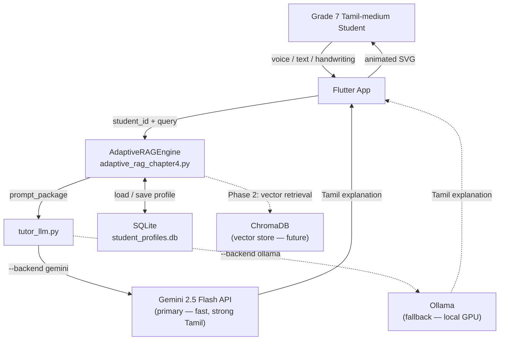
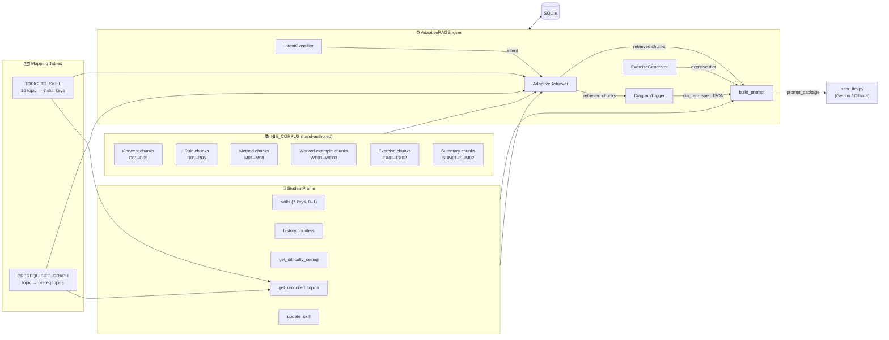
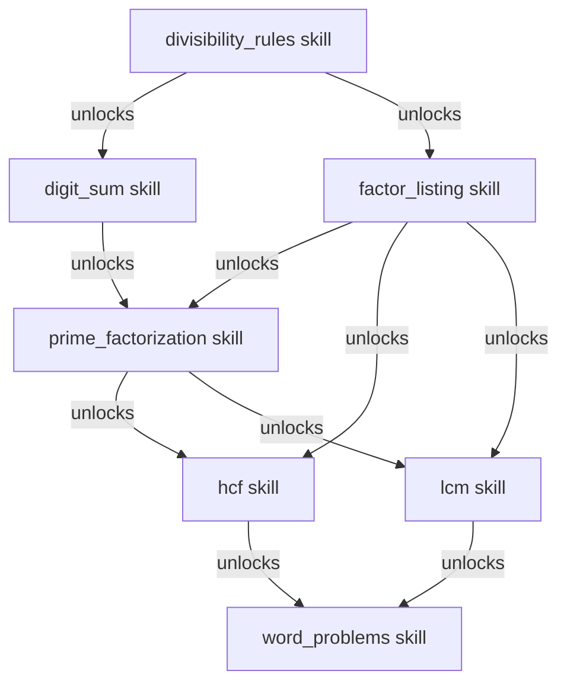
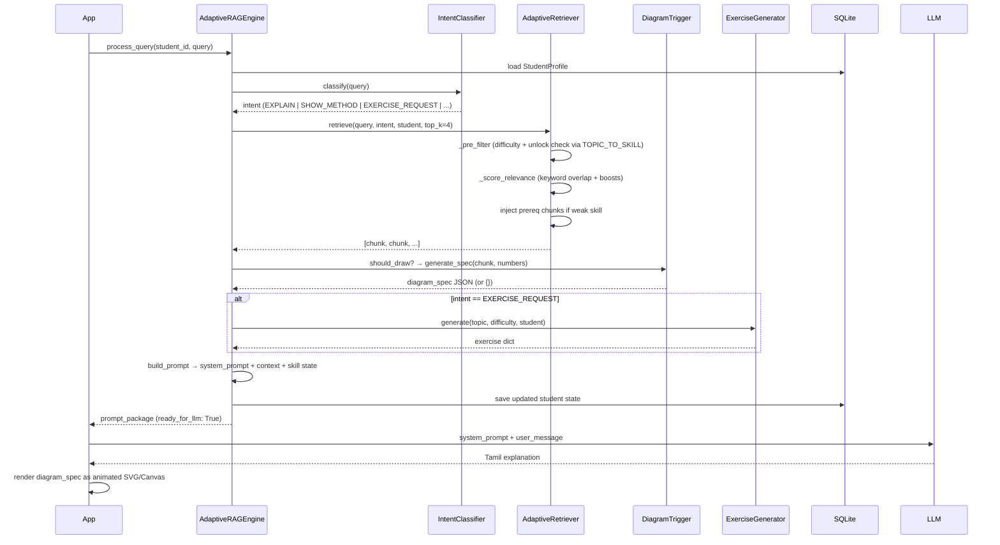

# Adaptive RAG Engine — Architecture

**Files:** `adaptive_rag_chapter4.py` (engine) + `tutor_llm.py` (LLM bridge)  
**Subject:** NIE Grade 7 Mathematics — Chapter 4 (காரணிகளும் மடங்குகளும்)  
**Purpose:** Tamil-medium PoC orchestration layer; the engine builds complete LLM prompt packages, and the bridge sends them to the LLM backend (Gemini API or Ollama).

---

## 1. High-Level System Context



---

## 2. Component Map



---

## 3. Data Model — `NIE_CORPUS` Chunk Schema

Every chunk is a Python dict with this shape:

```
{
  "id":          "C01"          # unique — used for retrieval debug
  "type":        "concept"      # concept | rule | method | worked_example
                                # | exercise | summary
  "topic":       "factor_definition"   # key into PREREQUISITE_GRAPH & TOPIC_TO_SKILL
  "section":     "4.1"          # NIE textbook section
  "page":        33             # NIE page number (audit trail)
  "difficulty":  1              # 1=foundation  2=intermediate  3=advanced
  "prerequisites": ["topic_x"]  # redundant with PREREQUISITE_GRAPH (kept for readability)
  "content_ta":  "..."          # NIE-register Tamil text
  "key_terms":   {tamil: english}
  "diagram_trigger": "factor_tree" | "division_ladder" | "factor_pairs" | None
  "exercise_follow_up": "EX_id"  # (optional)
  -- type-specific extras --
  "question_ta", "answer", "solution_steps_ta", "socratic_hints"   # exercise
  "diagram_data"                                                    # worked_example
  "method_number", "nie_note", "worked_numbers"                     # method
  "rule_summary", "common_error", "test_examples"                   # rule
  "is_reference"                                                     # summary
}
```

---

## 4. Skill Hierarchy (TOPIC_TO_SKILL + PREREQUISITE_GRAPH)



Topic → skill resolution is via `TOPIC_TO_SKILL` (36 entries).  
Prerequisite evaluation is via `PREREQUISITE_GRAPH` (14 entries).  
Both tables share the same topic-name vocabulary.

---

## 5. Query Processing Pipeline



---

## 6. IntentClassifier — Priority Resolution (post-fix)

```
Query → keyword scoring across 6 intents
       → resolve by INTENT_PRIORITY (most-specific first):

  CHECK_ANSWER > DIAGRAM_REQUEST > SHOW_METHOD > EXERCISE_REQUEST > WORD_PROBLEM > EXPLAIN

"எப்படி காட்டு" → scores: SHOW_METHOD=2, EXPLAIN=0 → SHOW_METHOD  ✓
"வரை"            → scores: DIAGRAM_REQUEST=1          → DIAGRAM_REQUEST ✓
"என்றால் என்ன"   → scores: EXPLAIN=1                 → EXPLAIN ✓
```

---

## 7. AdaptiveRetriever — Two-Stage Filter

```
Stage 1 — Pre-filter
  ├── type allowed for intent?  (e.g. EXPLAIN → concept, summary only)
  ├── difficulty ≤ ceiling + 1?
  └── topic in student.get_unlocked_topics()?
      └── uses TOPIC_TO_SKILL to map prereq topics → skill keys → student.skills

Stage 2 — Relevance score
  ├── query word ∩ chunk content word overlap
  ├── +0.20 if matches student.preferred_method
  ├── +0.15 if matches student.last_topic
  └── -0.30 if chunk difficulty > ceiling + 1

Post-retrieval injection
  └── For each result chunk, if prereq skill < 0.4 → inject prereq concept chunk
```

---

## 8. DiagramTrigger — JSON Spec Contracts

The Flutter renderer reads these JSON shapes:

```
factor_tree        → { diagram, root, tree{value,left{},right{}}, prime_factors[], result_label_ta, animate_step_by_step }
division_ladder    → { diagram, numbers[], steps[{divisor,before[],after[]}], hcf_value, hcf_product_shown, animate }
factor_pairs       → { diagram, number, pairs[][], all_factors[], label_ta, show_multiplication, animate }
multiples_line     → { diagram, numbers[], show_up_to, highlight_common[], lcm_value, label_ta, color_map{} }
```

---

## 9. StudentProfile — Skill Lifecycle

```
Create / Load    ←→  SQLite (safe via from_dict — forward-compatible)
       ↓
get_difficulty_ceiling()  →  avg(skills) < 0.3 → 1   < 0.6 → 2   else 3
       ↓
get_unlocked_topics()     →  BFS over PREREQUISITE_GRAPH
                              resolve topics → skills via TOPIC_TO_SKILL
                              skill ≥ 0.5 → topic unlocked
       ↓
update_skill(topic, correct, difficulty)
       →  skill_key = TOPIC_TO_SKILL[topic]
       →  correct:  skills[key] += 0.1 × difficulty   (max 1.0)
       →  wrong:    skills[key] -= 0.05                (min 0.0)
       ↓
Save → SQLite (JSON blob)
```

---

## 10. Bugs Fixed (summary)

| # | Bug | Root cause | Fix |
|---|-----|-----------|-----|
| A | Pre-filter passed topic names to `student.skills.get()` | `student.skills` uses 7 skill keys; PREREQUISITE_GRAPH uses topic names | Added `TOPIC_TO_SKILL` + fixed `_pre_filter` to resolve topics → skills |
| B | `get_unlocked_topics(prereqs)` wrongly compared topics to skill values | Same namespace mismatch | Rewrote to BFS over PREREQUISITE_GRAPH, resolving via `TOPIC_TO_SKILL` |
| C | `classify()` returned arbitrary intent on keyword tie | `max()` over dict is order-dependent | Added `INTENT_PRIORITY` ordered list; first intent with score > 0 wins |
| D | `_build_factor_tree` walked a flat list (linear) | Not a proper binary branching structure | Rewrote as recursive nested `{value, left, right}` tree |
| E | HCF ladder `hcf_product` was product of *any-2-divide* rows | NIE HCF rule: ALL numbers must divide | Fixed loop condition; added `math.gcd` verification guard |
| F | Digit-sum-9 answer list used double-sum heuristic | Missed multi-step repeated-digit-sum cases (e.g. 999→27→9) | Replaced with canonical `_digit_sum()` that loops until single digit |
| G | `StudentProfile(**data)` breaks on schema changes | Unknown DB keys cause TypeError | Added `StudentProfile.from_dict()` that ignores unknown keys |
| H | `IntentClassifier` had "எப்படி" in both EXPLAIN and SHOW_METHOD | Keyword appeared in lower-priority intent | Moved "எப்படி" to SHOW_METHOD only; EXPLAIN uses more-specific phrases |

---

## 11. LLM Backend — `tutor_llm.py`

The bridge script connects `AdaptiveRAGEngine` to an LLM. It supports two backends:

| Backend | CLI | Model | Speed | Tamil Quality |
|---------|-----|-------|-------|---------------|
| **Gemini API** (default) | `--backend gemini` | `gemini-2.5-flash` | 1-3s first token | Strong multilingual, natural Tamil |
| Ollama (fallback) | `--backend ollama` | `llama3:latest` etc. | Minutes on CPU | Weak Tamil without GPU |

**Configuration:**
- Gemini: set `GEMINI_API_KEY` in environment or `.env` file (free tier at https://aistudio.google.com/apikey)
- Ollama: set `OLLAMA_HOST` (default `http://127.0.0.1:11434`)

**Data flow:**
1. `AdaptiveRAGEngine.process_query()` produces `prompt_package` with `system_prompt` and `user_message`
2. `tutor_llm.py` passes these directly to the selected LLM backend
3. Gemini receives `system_prompt` as `system_instruction` and `user_message` as `contents`
4. Response is streamed token-by-token to stdout with timing metrics on stderr

---

## 12. What the Engine Does NOT Do

- Call any LLM — it produces `prompt_package` for `tutor_llm.py`.
- Do vector-similarity retrieval — Phase 2 replaces `_score_relevance` with ChromaDB.
- Cover grades beyond 7, or chapters beyond Chapter 4.
- Handle Sinhala, voice, handwriting, or multimodal input.
- Implement a teacher dashboard, auth, or content CMS.
