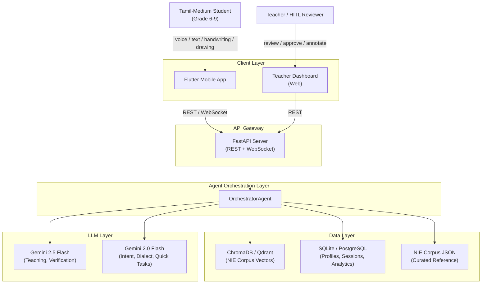
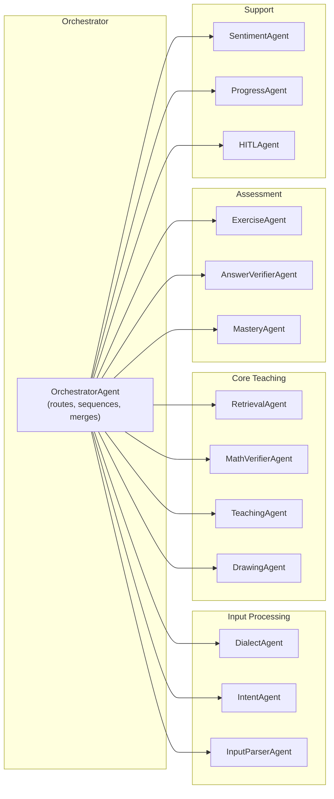
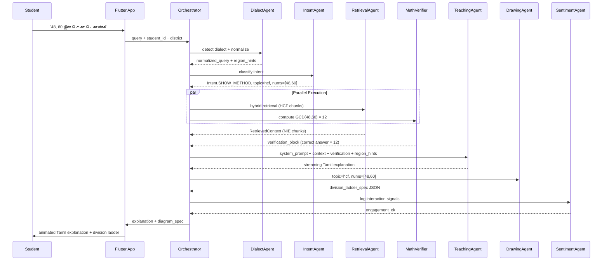

# Enterprise Architecture: NIE Tamil AI Tutor Platform

> Multi-adaptive agentic architecture for Grade 6–9 Tamil-medium
> Mathematics and Science tutoring, aligned with the NIE curriculum.

---

## 1. Side-by-Side Codebase Comparison

### 1.1 Architecture Patterns

| Dimension | Existing PoC | Claude-Generated Code |
|---|---|---|
| **Pattern** | Monolithic engine (1 891 lines) | Multi-agent (8 specialist agents) |
| **Files** | `adaptive_rag_chapter4.py` + `tutor_llm.py` | `src/agent_orchestrator.py` + `src/pipeline_ingestion.py` |
| **Corpus** | 25 hand-authored JSON chunks (`NIE_CORPUS`) | Vector DB via ChromaDB + BGE-M3 embeddings |
| **Retrieval** | Keyword overlap + metadata pre-filter | Filtered vector search (labelled "hybrid") |
| **LLM** | Gemini 2.5 Flash (streaming, thinking-budget control) | Gemini 2.0 Flash (query) + 2.5 Flash (teaching) |
| **Math accuracy** | Deterministic verification blocks injected into prompts | No deterministic math verification |
| **Student profile** | SQLite with safe deserialization | SQLite with session tracking |
| **Pedagogy** | NIE method guidance, Socratic rules with exceptions, regional dialect bridging | Basic Socratic rules, dialect detection stubs |
| **Status** | **Working end-to-end** | **Not tested** |

### 1.2 What to Keep from Each

**From the existing PoC (proven):**

- Deterministic math verification (`_positive_divisors`, `_factor_verification_block_tamil`, `_hcf_verification_block_tamil`)
- NIE register enforcement and regional dialect bridging (`_nie_register_and_ladder_guidance`)
- Socratic rule with explicit exceptions for direct computational queries
- Gemini streaming integration with `thinking_budget=0`
- `PREREQUISITE_GRAPH` and `TOPIC_TO_SKILL` mappings
- NIE-method-specific prompt sections (Section 4.1 pair method, Section 4.4 prime factorization)

**From the Claude code (adopt the patterns):**

- Multi-agent separation of concerns
- PDF ingestion pipeline with TSCII handling, semantic chunking, ChromaDB storage
- BGE-M3 embeddings for multilingual Tamil vector search
- Answer scheme ingestion as a separate collection
- `VerificationAgent` concept
- Typed dataclass message protocol (`QueryContext`, `RetrievedContext`, etc.)

**Build new:**

- True hybrid search (vector + BM25 keyword, not just filtered vector)
- LLM-based intent classification with rule-based fallback
- Event-driven student analytics pipeline
- HITL review queue
- Multimodal input pipeline

---

## 2. Target Architecture

### 2.1 System Context



### 2.2 Agent Architecture



### 2.3 Agent Responsibilities

| Agent | Responsibility | LLM? | Key Source |
|---|---|---|---|
| **DialectAgent** | Region detection, NIE term normalization, synonym bridging | Rule-based (LLM fallback) | Existing `_nie_register_and_ladder_guidance` |
| **IntentAgent** | Two-tier intent + topic + number extraction | Rule-based + Gemini 2.0 Flash fallback | Existing `IntentClassifier` + Claude `QueryAgent` |
| **InputParserAgent** | Voice/handwriting/drawing → normalized text | External APIs | New |
| **RetrievalAgent** | Hybrid vector + keyword search, metadata pre-filter, prereq injection | No | Existing `AdaptiveRetriever` + Claude `RetrievalAgent` |
| **MathVerifierAgent** | Deterministic factor/HCF/LCM computation, verification block injection | No | Existing `_positive_divisors`, `_factor_verification_block_tamil`, `_hcf_verification_block_tamil` |
| **TeachingAgent** | NIE-aligned Tamil explanation with streaming | Gemini 2.5 Flash | Existing `build_prompt` + `tutor_llm.py` |
| **DrawingAgent** | Diagram JSON specs for Flutter canvas | No | Existing `DiagramTrigger` |
| **ExerciseAgent** | Generate calibrated exercises | No | Existing `ExerciseGenerator` |
| **AnswerVerifierAgent** | Deterministic + LLM answer checking against schemes | Gemini 2.5 Flash | Claude `VerificationAgent` + existing Socratic rules |
| **MasteryAgent** | Skill updates, adaptive topic progression | No | Existing `update_skill` + `PREREQUISITE_GRAPH` |
| **SentimentAgent** | Engagement/confidence/frustration signals | Rule-based | New |
| **ProgressAgent** | Skill tracking, reporting, analytics | No | New |
| **HITLAgent** | Flag interactions for teacher review | No | New |

### 2.4 Data Flow: Complete Query Lifecycle



### 2.5 Data Architecture

**Vector Store (ChromaDB → Qdrant for production):**

- Collection per chapter: `nie_curriculum_g7_ch4_math`
- Embedding: BGE-M3 (multilingual, 1024-dim)
- Metadata: `topic`, `section`, `difficulty`, `type`, `page`, `prerequisites`, `method_number`
- Query: dense vector similarity + metadata filter + keyword boost

**Relational Store (SQLite → PostgreSQL for production):**

- `students` — profile, district, grade
- `skills` — student_id, skill_name, score (0.0–1.0)
- `sessions` — session_id, student_id, timestamps
- `interactions` — query, intent, response summary, timings
- `exercise_outcomes` — question, student answer, correctness, method alignment
- `sentiment_signals` — engagement score, confidence, frustration flags
- `hitl_queue` — flagged interactions for teacher review

**Curated Reference (JSON, version-controlled):**

- `NIE_CORPUS` — hand-reviewed authoritative chunks (gold-standard fallback)
- `PREREQUISITE_GRAPH` — topic dependency DAG
- `TOPIC_TO_SKILL` — mapping for skill tracking
- `GLOSSARY` — NIE terminology with regional variants

---

## 3. Addressing Enterprise Concerns

### Concern 1: Dynamic Context Engineering

Hybrid retrieval pipeline replaces hardcoded corpus:

1. Offline ingestion via `pipeline_ingestion.py` (PDF → chunks → BGE-M3 → ChromaDB)
2. Online retrieval: intent-filtered vector search + keyword re-rank + prereq injection
3. Curated `NIE_CORPUS` fallback when vector results score below threshold

### Concern 2: Multimodal Input

`InputParserAgent` normalizes all modalities to text:

- Voice: Google Cloud Speech-to-Text Tamil (`ta-IN`)
- Handwriting: Google ML Kit Digital Ink Recognition
- Drawing: Flutter CustomPaint + shape recognition + Gemini vision

### Concern 3: Correct Answer Methods

- Corpus chunks tagged with `method_number` (Method I/II/III)
- Answer schemes ingested with method tags
- `AnswerVerifierAgent` checks method used, not just correctness
- TeachingAgent system prompt enforces NIE method hierarchy

### Concern 4: Engagement and Sentiment

Rule-based signals: session duration, retry count, accuracy trends, frustration keywords.
Encouragement injection when confidence drops.

### Concern 5: Progress Measurement

Per-skill mastery (0.0–1.0), topic completion %, error pattern analysis, time-to-mastery.

### Concern 6: HITL

Automatic flagging: stuck students, quality failures, out-of-corpus requests.
Teacher dashboard: review queue, annotation, override.

### Concern 7: Additional Concerns

- Conversation memory (sliding window per session)
- Content versioning (corpus version tracking)
- Offline-first (IndexedDB/Hive caching)
- Cost management (Gemini 2.0 Flash for cheap tasks, 2.5 Flash for teaching)
- Observability (structured logging for all agent decisions)

---

## 4. Phased Roadmap

| Phase | Weeks | Deliverable |
|---|---|---|
| **1. Foundation Merge** | 1–3 | Multi-agent backend + vector DB, CLI + API |
| **2. Assessment** | 4–5 | Method-aware verification, conversation memory, adaptive progression |
| **3. Engagement** | 6–7 | Sentiment tracking, progress analytics, encouragement |
| **4. HITL** | 8–9 | Teacher dashboard, review queue, annotation workflow |
| **5. Multimodal** | 10–12 | Voice ASR, handwriting, drawing pad integration |

---

## 5. File Structure

```
ai-mathematics/
  src/
    agents/
      __init__.py
      orchestrator.py
      dialect_agent.py
      intent_agent.py
      retrieval_agent.py
      math_verifier.py
      teaching_agent.py
      drawing_agent.py
      exercise_agent.py
      answer_verifier.py
      mastery_agent.py
      sentiment_agent.py
      progress_agent.py
      hitl_agent.py
      input_parser.py
    data/
      nie_corpus.py
      prerequisite_graph.py
      glossary.py
    ingestion/
      pipeline.py
      vector_store.py
      answer_schemes.py
    models/
      student.py
      messages.py
      intents.py
    storage/
      db.py
    api/
      server.py
      websocket.py
    config.py
    llm_client.py
  data/
    vectordb/
  tests/
  requirements.txt
  ENTERPRISE_ARCHITECTURE.md
```
