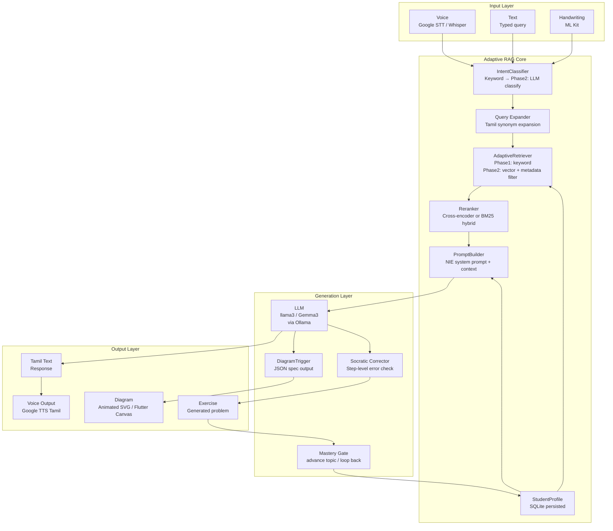

# Vector DB & Proper Adaptive RAG Design

---

## 1. Do You Need a Vector DB?

**Short answer: Yes — starting from PoC Phase 2.**

The current `adaptive_rag_chapter4.py` uses **keyword-overlap scoring** (word intersection ratio). This is fast and transparent but has three critical limits:

| Problem | Keyword scoring | Vector DB |
|---------|----------------|-----------|
| Tamil synonyms | "காரணி" ≠ "வகுக்கும் எண்" even if meaning is identical | Embedding similarity captures semantic closeness |
| Paraphrases | "பொ.கா.பெ. என்றால் என்ன?" vs "மிகப்பெரிய பொதுக் காரணி விளக்கு" | Same concept — vector distance handles this |
| Multi-concept queries | "HCF and LCM difference" — two topics in one question | Vector query retrieves both relevant chunks naturally |
| New chapters / scale | 10+ chapters × 50 chunks = 500+ chunks — keyword scanning degrades | Sub-millisecond ANN search regardless of corpus size |

**For a 20-chunk PoC covering one chapter: keyword scoring is fine.**  
**For a 500-chunk production corpus covering grades 6–9: vector DB is essential.**

---

## 2. Recommended Vector DB Stack

```
Phase 1 (PoC)         — keyword scoring in adaptive_rag_chapter4.py  ✓
Phase 2 (Pilot)       — ChromaDB local (already in requirements.txt)
Phase 3 (Production)  — Qdrant Cloud or Weaviate with hybrid search
```

### Why ChromaDB first
- Zero config (`chromadb.PersistentClient("./chroma")`)
- Runs on-device (offline — critical for Northern Province)
- Already installed from `rag_poc.py`

### Embedding model choice
- `nomic-embed-text` (already pulled via Ollama) — 768-dim, good multilingual coverage
- **Better for Tamil:** `intfloat/multilingual-e5-large` — trained on 100 languages, Tamil included; run via `sentence-transformers` or `llama-index-embeddings-huggingface`
- **Best when available:** A fine-tuned Tamil embedding model (University of Moratuwa NLP lab has active work here)

---

## 3. Proper Adaptive RAG Design — Full PoC Architecture

### 3.1 System Overview



### 3.2 Retrieval Pipeline (Phase 2)

```
Student query  →  Query expansion
                  (add NIE-term synonyms: HCF ↔ பொ.கா.பெ.)
     ↓
Metadata pre-filter
  difficulty ≤ ceiling + 1
  topic ∈ unlocked_topics (via TOPIC_TO_SKILL + PREREQUISITE_GRAPH)
  intent → allowed chunk types
     ↓
Dense vector retrieval  (top-16 candidates)
  embed query → nomic-embed-text / multilingual-e5-large
  ANN search in ChromaDB / Qdrant
     ↓
Hybrid re-rank  (top-4 final)
  BM25 score  (term match)
  cross-encoder score  (semantic)
  student-boost:  +0.2 last_topic match, +0.1 preferred_method
     ↓
Prerequisite injection
  if skill[prereq] < 0.5 → insert prereq concept chunk at position 0
```

### 3.3 Four-Stage Tutoring Loop

```
Stage 1 — EXPLAIN (EXPLAIN intent)
  Retrieve concept + rule chunks
  LLM generates Tamil explanation anchored to retrieved NIE text
  DiagramTrigger fires if relevant (factor tree, etc.)

Stage 2 — SHOW_METHOD (SHOW_METHOD / DIAGRAM_REQUEST intent)
  Retrieve method + worked_example chunks
  LLM outputs step-by-step Tamil walkthrough
  DiagramTrigger generates animated JSON spec

Stage 3 — GUIDED EXERCISE (EXERCISE_REQUEST intent)
  ExerciseGenerator produces calibrated problem
  Student submits on writing pad → text or typed
  Socratic Corrector checks each step (not just final answer)
  If wrong: returns one guiding question; never states correct answer
  If right after N steps: advance to Stage 4

Stage 4 — MASTERY CHECK
  After 3–4 correct exercises on a topic:
    update_skill(topic, correct=True, difficulty=d)
    get_difficulty_ceiling() recalculates
    get_unlocked_topics() recalculates
    if new topics unlocked: notify student + offer next concept
    else: loop Stage 3 with higher difficulty or adjacent topic
```

### 3.4 Prompt Architecture

```
system_prompt:
  [Role]           "You are an NIE Grade 7 Tamil tutor"
  [Language rules] Tamil-only, NIE vocabulary, no Romanisation
  [Pedagogy rules] Socratic — never give answer, ask one guiding question
  [Student state]  difficulty=2/3, last_topic=hcf, last_error=used_lcm_for_hcf
  [NIE context]    retrieved chunks (section, page, Tamil text)

user_message:
  student's original query (Tamil)

optional attachments:
  diagram_spec (JSON — Flutter renders, not the LLM)
  exercise (dict — appended if EXERCISE_REQUEST)
  student_attempt (if CHECK_ANSWER)
```

---

## 4. ChromaDB Integration into adaptive_rag_chapter4.py (Phase 2 Plan)

Replace `AdaptiveRetriever._score_relevance` with this pattern:

```python
# Phase 2 retrieval replacement (not yet in the file)
import chromadb
from llama_index.embeddings.ollama import OllamaEmbedding

class VectorAdaptiveRetriever(AdaptiveRetriever):

    def __init__(self, corpus: list, chroma_path: str = "./chroma_nie"):
        super().__init__(corpus)
        self.embed_model = OllamaEmbedding(model_name="nomic-embed-text")
        client = chromadb.PersistentClient(path=chroma_path)
        self.collection = client.get_or_create_collection("nie_corpus")
        # Index corpus on first run
        if self.collection.count() == 0:
            self._index_corpus()

    def _index_corpus(self):
        for chunk in self.corpus:
            text = chunk["content_ta"]
            embedding = self.embed_model.get_text_embedding(text)
            self.collection.add(
                ids=[chunk["id"]],
                embeddings=[embedding],
                metadatas=[{
                    "type":       chunk["type"],
                    "topic":      chunk["topic"],
                    "difficulty": chunk.get("difficulty", 1),
                }],
                documents=[text],
            )

    def retrieve(self, query: str, intent: str,
                 student: StudentProfile, top_k: int = 4) -> list:
        # Metadata filter for student level + intent
        allowed_types = self._type_map(intent)
        max_diff = student.get_difficulty_ceiling()
        query_embedding = self.embed_model.get_text_embedding(query)

        results = self.collection.query(
            query_embeddings=[query_embedding],
            n_results=min(16, self.collection.count()),
            where={
                "$and": [
                    {"difficulty": {"$lte": max_diff + 1}},
                    {"type": {"$in": allowed_types}},
                ]
            },
        )
        # Map back to corpus dicts
        id_to_chunk = {c["id"]: c for c in self.corpus}
        retrieved = [
            id_to_chunk[cid]
            for cid in results["ids"][0]
            if cid in id_to_chunk
        ]
        # Prereq injection (same logic as before)
        return self._inject_prereqs(retrieved, student, top_k)
```

---

## 5. Evaluation Metrics for the PoC Pilot

| Metric | Method | Target |
|--------|--------|--------|
| Retrieval precision@4 | Human labels: does retrieved chunk match question? | ≥ 0.80 |
| Tamil fluency | Native speaker 1–5 rating on 20 sampled responses | ≥ 4.0 |
| NIE terminology accuracy | % responses using correct NIE terms | ≥ 90% |
| Socratic compliance | % responses that do not state the answer | ≥ 95% |
| Exercise answer accuracy | Correct answers from ExerciseGenerator | 100% |
| Student learning gain | Pre/post NIE-aligned assessment Δ | ≥ 0.25 SD |

---

## 6. Offline-First Architecture (Northern Province requirement)

```
Device storage:
  ChromaDB local (≈ 80 MB for full G6–G9 corpus)
  Ollama llama3 or Gemma 3:2B (2–4 GB)
  nomic-embed-text (274 MB — already pulled)
  SQLite student_profiles.db (< 1 MB)

Online sync:
  Student sessions cached in IndexedDB (PWA) or SQLite (Flutter)
  Sync to Supabase / Firebase when connectivity available
  Conflict resolution: local-wins (student's progress is authoritative)

Model selection for offline:
  Gemma 3:2B (1.9 GB) — sufficient for explanation + exercise quality
  Gemma 3:9B (5.4 GB) — better Tamil quality, needs 8 GB RAM device
  llama3:latest (4.7 GB) — already present, use as interim
```
